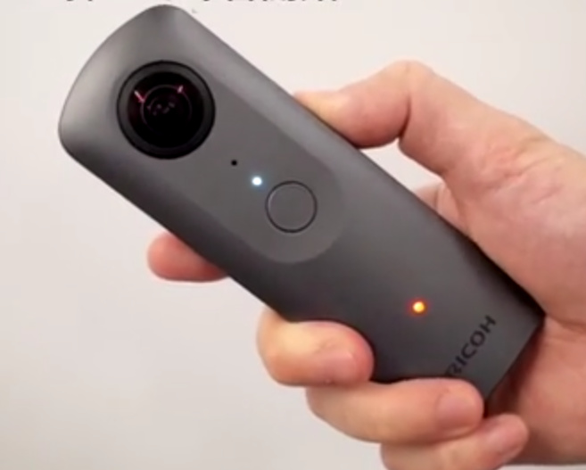
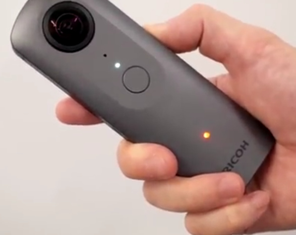
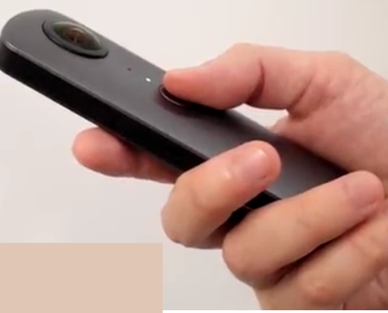
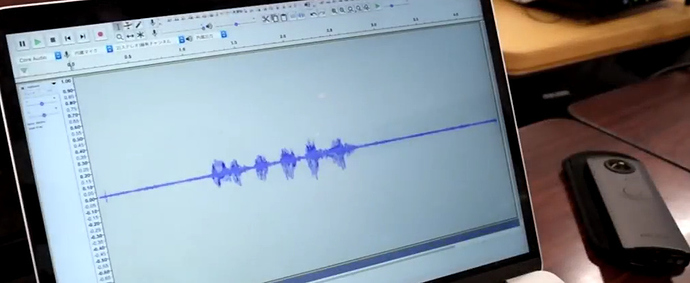

# RICOH THETA Microphone Plug-in

This project and article was [originally published in Qiita](https://qiita.com/kushimoto/items/e2ee2b1abd05dc50ffcf) by [Mr. Kushimoto](https://qiita.com/kushimoto) or Ricoh.

I edited the article and deleted some of the references to Japanese documents that we don&rsquo;t have in English.

2018/10/09 Addendum: I confirmed that I can connect the speaker to THETA and play it at high volume! [Editor note: see [related article](https://community.theta360.guide/t/how-to-connect-a-speaker-to-ricoh-theta-with-usb-otg-to-get-good-sound-volume-from-camera/3732?u=codetricity)]

Since the RICOH THETA V is an Android-based device, it can be expanded by installing an application. For the RICOH THETA, the application is called a plug-in.

In this article, I will show you how to record using the microphone with the THETA plug-in.

point

The points are as follows.

* Set to record in monaural
* Add permission to change audio settings

## 1. Set to record in monaural

THETA V is capable of recording 360 ° spatial sound by 4ch microphone.

When shooting movies using the Web API, you can acquire videos with spatial sounds, and you can also capture wav files of spatial sounds when shooting movies using the Camera API (For the Camera API, It is planned to be).

However, when using the standard Android API, it is not compatible with 360 ° spatial audio, so it is necessary to record in monaural.

THETA V adds some parameters to the [AudioManager](https://developer.android.com/reference/android/media/AudioManager) API.

By using the **B-format Selection** parameter, you can set to record in mono.

To set it to monaural, pass `RicUseBFormat = false`  to `setParameters ()` of `AudioManager` before using the microphone as below.

    AudioManager audioManager = (AudioManager) getSystemService(Context.AUDIO_SERVICE);
    audioManager.setParameters("RicUseBFormat=false");

## 2. Add authority to change audio settings

Since you change the audio setting using AudioManager as shown in 1, add the following authority to AndroidManifest.xml (RECORD_AUDIO is also required as it is necessary).

    <uses-permission android:name="android.permission.MODIFY_AUDIO_SETTINGS" /> 
    <uses-permission android:name="android.permission.RECORD_AUDIO" />

## Sample code

If you keep the above points, the rest is the same as general Android application development.

In this article, I tried to create a plugin to record using MediaRecorder as sample code.

The source code is at the bottom of this article.

Press the radio button to start recording, and press the wireless button again to end recording.

Recording sound can be played by pressing the shutter button.

Although you can understand when you run the sample code, the volume to be played is fairly small.

This is because the THETA V speaker is designed only to reproduce the original operation sound.

Although electronic sound can sound as it is, it is not strong for the recorded natural sound like this time, so please be careful when making plug-in with speaker.

It is like this when you move it.

### Press the Wi-Fi button the side to start recording audio.

### Press the Wi-Fi button again to stop recording audio

### Playing Sound on THETA

As the THETA speaker is not intended to replay natural sounds, the speaker volume is low.

Although playing the sound on the THETA is soft, the sound file actually has the correct volume.

### Transfer File to laptop

Playing the sound file on a laptop shows that the sound file was successfully recorded with the correct volume.

 

### YouTube Video in Japanese

The video below is in Japanese, but you can follow along with the screenshots I put above that are in English. The main part is to listen to the sound clip from the laptop.

https://youtu.be/0ipgLlGikMM

[Additional notes] I tried connecting a speaker to THETA

When playing with THETA, the volume was small, so I tried connecting the speaker to THETA via USB OTG.

See this article in English that describes Mr. Kushimoto's successful use of an external speaker with the THETA to achive good sound volume.

https://community.theta360.guide/t/how-to-connect-a-speaker-to-ricoh-theta-with-usb-otg-to-get-good-sound-volume-from-camera/3732?u=codetricity

(↓ is a link to YouTube in Japanese, but see the article above in English for the same information).

https://youtu.be/eIyVM0iEQLY

I was able to play with a loud volume!

The equipment I used this time is ↓.

* USB DAC (USB Audio Class 1.0)
* USB OTG adapter (converted to micro B because USB DAC was Type A)
* Analog speaker (Built-in amplifier and battery)

In this experiment, you can play with the external speaker without changing the source code.

In other words, you can use OTG compliant USB device as it is with THETA! I understood that.

OTG USB support depends on the product. Some adapters will work and  some won't. Please experiment with each product!

**Please be careful that we are not guaranteeing the operation with these equipment. Use this guide at your own responsibility**

## Summary

In this article, I showed you how to use a microphone with THETA.

If you keep the point unique to THETA V, you can develop it like a general Android application, so if you are an Android developer, please feel free to try it.

If you are interested in THETA plug-in development, please register with our [partner program](https://api.ricoh/products/theta-plugin/)!

Please note that THETA serial number applied at the time of registration will not be subject to manufacturer support.

